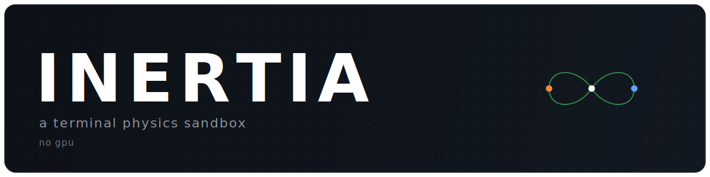
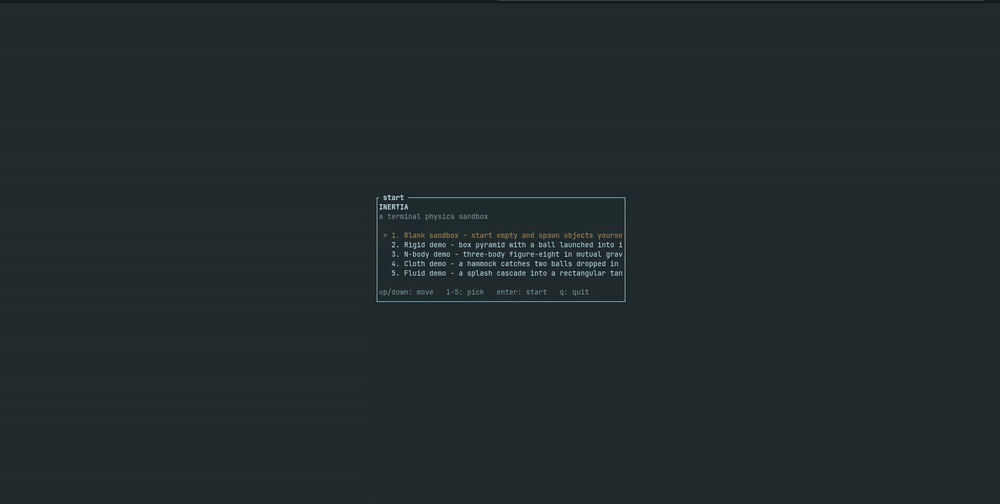

<p align="center">
  
</p>

<p align="center">
  
  
  
  
  
</p>

<p align="center">
  <em>A physics sandbox that runs in your terminal. Rigid bodies, n-body gravity, cloth, and fluid, projected in 3D onto braille cells with no GPU.</em>
</p>

<p align="center">
  
</p>

## What it is

Inertia is a real-time 3D physics playground rendered entirely in text. There is no
window, no GPU, and no web view: the whole scene is projected by hand onto ratatui's
braille canvas, so it runs anywhere a terminal does, including over SSH, inside a
container, or on a headless box.

It bundles four different simulations behind one camera and one UI:

- **Rigid bodies** (via [rapier3d](https://rapier.rs)): spawn boxes and spheres, stack
  them, launch them, watch them bounce and settle.
- **N-body gravity**: stars in mutual attraction, with a brute-force or Barnes-Hut
  solver and fading orbit trails. Ships with the three-body figure-eight choreography.
- **Cloth**: a custom Verlet spring-mass mesh you can pin, drag, drape over rigid
  bodies, and blow around with wind.
- **Fluid**: an SPH particle fluid you can pour, splash, and drop rigid bodies into.

Run up to nine independent sandboxes side by side and switch between them live.

## Install

From source:

```sh
git clone https://github.com/aclfe/inertia
cd inertia
cargo run --release
```

Or install the binary (published as `inertia-tui`, the command is `inertia`):

```sh
cargo install inertia-tui
inertia
```

A terminal with truecolor and mouse support gives the best experience. Pick a demo from
the start menu, or start blank and build a scene yourself.

## How it works

The scene is always 3D. Each frame transforms every body from world space through the
camera and a perspective projection down to normalized device coordinates, corrects for
the 2:1 height-to-width ratio of terminal cells, and maps the result onto the braille
canvas. With no per-pixel depth buffer available, bodies are depth-sorted and drawn
back to front (painter's algorithm).

Physics runs on a fixed 1/60s timestep decoupled from rendering, driven by an
accumulator with a wall-clock catch-up budget: if a step gets too heavy to keep up (a
large fluid pool on slow hardware), the simulation eases into slow motion instead of
stalling input and rendering.

## License

Dual-licensed under either of

- MIT license ([LICENSE-MIT](LICENSE-MIT))
- Apache License 2.0 ([LICENSE-APACHE](LICENSE-APACHE))

at your option.
